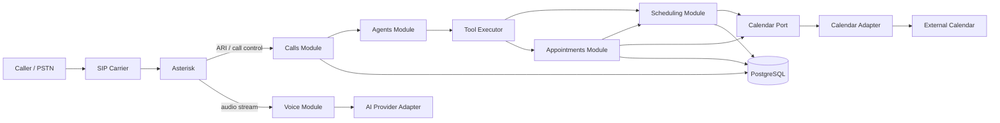

# YIBO Architecture, Module Contracts, and Codex Work Protocol

**Project:** YIBO — *Your Intelligent Booking Operator*  
**Document type:** Architecture contract / implementation guide  
**Status:** Initial architecture baseline  
**Version:** 0.1  
**Primary stack:** TypeScript / Node.js  

---

## 1. Purpose

This document defines the architectural boundaries of YIBO so that humans and coding agents such as Codex can work on the system module by module without accidentally coupling unrelated parts of the application.

It is both:

1. an **architecture specification**, and
2. a **contract for code-generation tasks**.

A task is considered architecturally valid only if it respects the boundaries, contracts, invariants, and dependency rules defined here.

### 1.1 Product definition

YIBO is a multi-tenant AI receptionist platform whose primary interface is a telephone conversation. It can understand a caller's request, query real availability, create/cancel/reschedule appointments, and transfer a call to a human when required.

### 1.2 Core architectural principle

> **The AI converses. YIBO decides and executes. The telephony layer transports the call.**

The AI model is not the scheduling system, is not the database, and is not allowed to directly mutate business state.

---

## 2. Scope

### 2.1 MVP capabilities

The first vertical slice must support:

- inbound telephone call;
- identify the target tenant/business from the called number;
- answer the call;
- establish a realtime AI voice session;
- expose controlled tools to the AI;
- check appointment availability;
- create an appointment;
- cancel an appointment;
- transfer to a human;
- persist call and appointment state;
- integrate one external calendar provider;
- correlate logs for a complete call.

### 2.2 Explicit non-goals for the MVP

Do **not** introduce these unless a separate architecture decision authorizes them:

- microservices;
- Kubernetes;
- native SIP/RTP implementation;
- custom foundation-model training;
- generic CRM platform;
- workflow engine;
- multi-region active-active deployment;
- event sourcing;
- arbitrary plugin system;
- multiple calendar providers before the first provider works end-to-end.

---

## 3. Architectural style

YIBO starts as a **modular monolith** using **Ports and Adapters / Hexagonal Architecture**.

Asterisk runs as separate infrastructure because it is a telephony engine, not a YIBO domain module.



### 3.1 Architectural rule

Modules communicate through **public contracts**. They must not import implementation details from another module.

Allowed:

```ts
import { SchedulingService } from "@yibo/scheduling";
```

Forbidden:

```ts
import { PostgresAvailabilityRepository } from "@yibo/scheduling/infrastructure/postgres/...";
```

---

## 4. Proposed repository structure

```text
yibo/
├── apps/
│   ├── api/
│   │   └── src/
│   └── dashboard/
│       └── src/
│
├── src/
│   ├── modules/
│   │   ├── business/
│   │   │   ├── domain/
│   │   │   ├── application/
│   │   │   ├── ports/
│   │   │   ├── infrastructure/
│   │   │   └── index.ts
│   │   │
│   │   ├── customers/
│   │   ├── scheduling/
│   │   ├── appointments/
│   │   ├── calls/
│   │   ├── agents/
│   │   ├── voice/
│   │   ├── telephony/
│   │   └── integrations/
│   │
│   ├── shared/
│   │   ├── domain/
│   │   ├── errors/
│   │   ├── observability/
│   │   └── types/
│   │
│   └── bootstrap/
│
├── tests/
│   ├── integration/
│   └── e2e/
│
├── docs/
│   ├── architecture/
│   └── adr/
│
└── docker/
    └── asterisk/
```

### 4.1 Internal structure of a module

Each module follows the same shape when applicable:

```text
module/
├── domain/          # Entities, value objects, invariants
├── application/     # Use cases / orchestration
├── ports/           # Interfaces required by the module
├── infrastructure/  # Implementations of ports
└── index.ts         # ONLY public exports
```

`index.ts` is the module boundary.

---

## 5. Shared types and conventions

The following examples establish the shape of contracts. Exact implementation may evolve only through an explicit contract-change task.

```ts
export type TenantId = string;
export type BusinessId = string;
export type CustomerId = string;
export type EmployeeId = string;
export type ServiceId = string;
export type AppointmentId = string;
export type CallId = string;
export type AgentId = string;
export type ToolCallId = string;
export type IdempotencyKey = string;

export type ISODateTime = string;
export type IANATimeZone = string;
```

### 5.1 Time rules

- Persist timestamps in UTC.
- Every business has an IANA timezone such as `America/Merida`.
- Natural-language dates from the AI must be resolved into an absolute datetime **before** reaching appointment creation.
- Scheduling contracts must never depend on the server's local timezone.

### 5.2 Result convention

Expected business failures should not be thrown as generic exceptions.

```ts
export type Result<T, E> =
  | { ok: true; value: T }
  | { ok: false; error: E };
```

Unexpected infrastructure failures may throw and must be mapped at the application boundary.

---

# 6. Module map and ownership

| Module | Owns | Must not own |
|---|---|---|
| `business` | tenant/business configuration, services, employees, hours | appointment transactions, AI sessions |
| `customers` | customer identity/contact profile | scheduling rules |
| `scheduling` | availability calculation, slot generation, conflict rules | conversation logic, telephony |
| `appointments` | appointment lifecycle and consistency | speech, SIP, prompt generation |
| `calls` | call lifecycle and orchestration | appointment rules |
| `agents` | AI agent runtime, tool exposure, conversation policy | database writes for appointments |
| `voice` | audio/session bridge | business rules |
| `telephony` | telephony abstraction and Asterisk adapter | AI policy, scheduling |
| `integrations` | external provider adapters | domain policy |

---

# 7. Dependency rules

## 7.1 Allowed dependencies

```text
business ───────────────► shared
customers ──────────────► shared
scheduling ─────────────► business, shared, its own ports
appointments ───────────► scheduling, business, customers, shared, its own ports
agents ─────────────────► appointments public API, scheduling public API, calls public API, shared
calls ──────────────────► agents public API, telephony public API, voice public API, business public API, shared
voice ──────────────────► AI provider port, shared
telephony ───────────────► shared
integrations ────────────► provider contracts only
apps/api ────────────────► module public APIs
```

## 7.2 Forbidden dependencies

- `scheduling` -> `agents`
- `appointments` -> `agents`
- `appointments` -> Asterisk
- `agents` -> PostgreSQL repositories of other modules
- `voice` -> scheduling
- `telephony` -> appointments
- any domain module -> HTTP framework types
- any domain module -> provider-specific SDK types

### 7.3 Provider SDK isolation

Provider-specific types must stop at the adapter boundary.

Forbidden:

```ts
function createAppointment(event: GoogleCalendarEvent): void;
```

Correct:

```ts
function createAppointment(command: CreateAppointmentCommand): void;
```

The Google object is mapped inside `GoogleCalendarAdapter`.

---

# 8. Business module contract

## 8.1 Responsibility

Provides the configuration required by other modules to reason about a business.

## 8.2 Public contract

```ts
export interface BusinessDirectory {
  getBusinessByCalledNumber(
    phoneNumber: string,
  ): Promise<Result<BusinessProfile, BusinessLookupError>>;

  getBusinessProfile(
    tenantId: TenantId,
  ): Promise<Result<BusinessProfile, BusinessLookupError>>;
}

export interface BusinessProfile {
  tenantId: TenantId;
  businessId: BusinessId;
  name: string;
  timezone: IANATimeZone;
  locale: string;
  services: ServiceDefinition[];
  employees: EmployeeDefinition[];
  openingHours: OpeningHoursRule[];
}
```

### Invariants

- A called phone number maps to at most one active tenant.
- Every active business has a valid timezone.
- Service duration must be positive.
- An employee referenced by a scheduling rule belongs to the same tenant.

---

# 9. Scheduling module contract

## 9.1 Responsibility

Compute whether a resource can accept an appointment and return valid candidate slots.

It does **not** create appointments.

## 9.2 Public API

```ts
export interface SchedulingService {
  findAvailableSlots(
    query: FindAvailableSlotsQuery,
  ): Promise<Result<AvailableSlot[], SchedulingError>>;

  validateSlot(
    query: ValidateSlotQuery,
  ): Promise<Result<ValidatedSlot, SchedulingError>>;
}

export interface FindAvailableSlotsQuery {
  tenantId: TenantId;
  serviceId: ServiceId;
  employeeId?: EmployeeId;
  rangeStart: ISODateTime;
  rangeEnd: ISODateTime;
  limit?: number;
}

export interface ValidateSlotQuery {
  tenantId: TenantId;
  serviceId: ServiceId;
  employeeId: EmployeeId;
  startAt: ISODateTime;
}

export interface AvailableSlot {
  employeeId: EmployeeId;
  startAt: ISODateTime;
  endAt: ISODateTime;
}

export interface ValidatedSlot extends AvailableSlot {
  validatedAt: ISODateTime;
}
```

## 9.3 Scheduling errors

```ts
export type SchedulingError =
  | { code: "SERVICE_NOT_FOUND" }
  | { code: "EMPLOYEE_NOT_FOUND" }
  | { code: "OUTSIDE_BUSINESS_HOURS" }
  | { code: "EMPLOYEE_UNAVAILABLE" }
  | { code: "SLOT_CONFLICT" }
  | { code: "INVALID_TIME_RANGE" }
  | { code: "EXTERNAL_CALENDAR_UNAVAILABLE"; retryable: boolean };
```

## 9.4 Availability sources

Availability is calculated from the intersection/subtraction of:

```text
Business opening hours
∩ Employee working hours
∩ Service requirements
- Breaks
- Local confirmed appointments
- Relevant external calendar busy intervals
= Candidate availability
```

### Invariants

- Returned slots never overlap a known confirmed appointment.
- Returned slots satisfy service duration and configured buffers.
- A `findAvailableSlots` result is a **snapshot**, not a reservation.
- Appointment creation must revalidate the slot.

---

# 10. Calendar port contract

The scheduling and appointment modules must depend on this abstraction, not on Google/Outlook SDKs.

```ts
export interface CalendarPort {
  getBusyIntervals(
    query: GetBusyIntervalsQuery,
  ): Promise<Result<BusyInterval[], CalendarError>>;

  createEvent(
    command: CreateCalendarEventCommand,
  ): Promise<Result<ExternalCalendarEvent, CalendarError>>;

  cancelEvent(
    command: CancelCalendarEventCommand,
  ): Promise<Result<void, CalendarError>>;
}

export interface GetBusyIntervalsQuery {
  tenantId: TenantId;
  employeeId: EmployeeId;
  rangeStart: ISODateTime;
  rangeEnd: ISODateTime;
}

export interface BusyInterval {
  startAt: ISODateTime;
  endAt: ISODateTime;
}

export interface CreateCalendarEventCommand {
  tenantId: TenantId;
  appointmentId: AppointmentId;
  employeeId: EmployeeId;
  title: string;
  startAt: ISODateTime;
  endAt: ISODateTime;
  idempotencyKey: IdempotencyKey;
}

export interface ExternalCalendarEvent {
  provider: string;
  externalEventId: string;
}

export type CalendarError =
  | { code: "AUTHORIZATION_REQUIRED" }
  | { code: "RATE_LIMITED"; retryAfterMs?: number }
  | { code: "PROVIDER_UNAVAILABLE"; retryable: boolean }
  | { code: "EVENT_NOT_FOUND" }
  | { code: "VALIDATION_ERROR"; message: string };
```

---

# 11. Appointments module contract

## 11.1 Responsibility

Own the appointment lifecycle and ensure that an AI request cannot create inconsistent business state.

## 11.2 Public API

```ts
export interface AppointmentService {
  createAppointment(
    command: CreateAppointmentCommand,
  ): Promise<Result<Appointment, CreateAppointmentError>>;

  cancelAppointment(
    command: CancelAppointmentCommand,
  ): Promise<Result<Appointment, CancelAppointmentError>>;

  rescheduleAppointment(
    command: RescheduleAppointmentCommand,
  ): Promise<Result<Appointment, RescheduleAppointmentError>>;

  getAppointment(
    query: GetAppointmentQuery,
  ): Promise<Result<Appointment, AppointmentLookupError>>;
}

export interface CreateAppointmentCommand {
  tenantId: TenantId;
  customerId: CustomerId;
  serviceId: ServiceId;
  employeeId: EmployeeId;
  startAt: ISODateTime;
  idempotencyKey: IdempotencyKey;
  source: "AI_CALL" | "DASHBOARD" | "API";
  sourceCallId?: CallId;
}

export interface Appointment {
  id: AppointmentId;
  tenantId: TenantId;
  customerId: CustomerId;
  serviceId: ServiceId;
  employeeId: EmployeeId;
  startAt: ISODateTime;
  endAt: ISODateTime;
  status:
    | "PENDING_CONFIRMATION"
    | "CONFIRMED"
    | "CANCELLED"
    | "FAILED";
  externalCalendarEventId?: string;
}
```

## 11.3 Creation errors

```ts
export type CreateAppointmentError =
  | { code: "SLOT_NO_LONGER_AVAILABLE" }
  | { code: "CUSTOMER_NOT_FOUND" }
  | { code: "SERVICE_NOT_FOUND" }
  | { code: "EMPLOYEE_NOT_FOUND" }
  | { code: "CALENDAR_SYNC_FAILED"; retryable: boolean }
  | { code: "IDEMPOTENCY_CONFLICT" }
  | { code: "VALIDATION_ERROR"; message: string };
```

## 11.4 Creation invariant

`createAppointment()` MUST NOT trust a previous availability query.

Required flow:

```text
receive create command
      ↓
validate tenant/customer/service/employee
      ↓
acquire scheduling concurrency guard
      ↓
revalidate local + external availability
      ↓
create PENDING_CONFIRMATION appointment
      ↓
create external calendar event
      ↓
mark CONFIRMED
      ↓
release guard
      ↓
return CONFIRMED appointment
```

The AI may only tell the caller that the appointment is confirmed if the returned appointment status is `CONFIRMED`.

## 11.5 Idempotency invariant

The same `(tenantId, idempotencyKey)` must never create two appointments.

Retries must return the previous successful result when semantically identical.

---

# 12. Customers module contract

```ts
export interface CustomerService {
  findOrCreateByPhone(
    command: FindOrCreateCustomerByPhoneCommand,
  ): Promise<Result<Customer, CustomerError>>;

  updateCustomer(
    command: UpdateCustomerCommand,
  ): Promise<Result<Customer, CustomerError>>;
}

export interface Customer {
  id: CustomerId;
  tenantId: TenantId;
  phone: string;
  name?: string;
  email?: string;
}
```

### Invariants

- Customer lookup is tenant-scoped.
- A customer from Tenant A must never be returned in Tenant B.

---

# 13. Telephony module contract

## 13.1 Responsibility

Abstract call control from the provider/telephony engine.

```ts
export interface TelephonyGateway {
  answer(callId: CallId): Promise<Result<void, TelephonyError>>;
  hangup(callId: CallId): Promise<Result<void, TelephonyError>>;
  transfer(
    callId: CallId,
    destination: TransferDestination,
  ): Promise<Result<void, TelephonyError>>;

  onEvent(handler: (event: TelephonyEvent) => Promise<void>): void;
}

export type TelephonyEvent =
  | {
      type: "INCOMING_CALL";
      callId: CallId;
      from: string;
      to: string;
      occurredAt: ISODateTime;
    }
  | {
      type: "CALL_HUNG_UP";
      callId: CallId;
      occurredAt: ISODateTime;
    }
  | {
      type: "DTMF_RECEIVED";
      callId: CallId;
      digit: string;
      occurredAt: ISODateTime;
    };

export type TransferDestination =
  | { type: "PHONE_NUMBER"; value: string }
  | { type: "EXTENSION"; value: string };
```

### Adapter

Initial implementation:

```ts
class AsteriskTelephonyGateway implements TelephonyGateway {}
```

### Invariants

- No scheduling/business logic inside the Asterisk adapter.
- Asterisk identifiers are mapped to YIBO `CallId` values at the boundary.
- Provider-specific exceptions are converted to `TelephonyError`.

---

# 14. Voice module contract

## 14.1 Responsibility

Bridge bidirectional audio between the telephony media stream and an AI voice session.

It must not decide what appointment operation to execute.

```ts
export interface VoiceBridge {
  start(command: StartVoiceBridgeCommand): Promise<Result<VoiceBridgeSession, VoiceError>>;
}

export interface StartVoiceBridgeCommand {
  callId: CallId;
  agentSession: AgentSession;
  inboundAudio: AsyncIterable<AudioFrame>;
  outboundAudio: AudioSink;
}

export interface AudioFrame {
  data: Uint8Array;
  codec: string;
  sampleRateHz: number;
  timestampMs?: number;
}

export interface AudioSink {
  write(frame: AudioFrame): Promise<void>;
}
```

### Invariants

- Voice module does not access appointments or calendars.
- Codec conversion belongs at media boundaries.
- Backpressure must be handled explicitly; unbounded audio buffering is forbidden.

---

# 15. AI provider contract

The Agents/Voice modules must not expose a provider SDK across their public boundary.

```ts
export interface VoiceAIProvider {
  openSession(
    config: OpenAgentSessionConfig,
  ): Promise<Result<ProviderAgentSession, AIProviderError>>;
}

export interface OpenAgentSessionConfig {
  callId: CallId;
  tenantId: TenantId;
  instructions: string;
  locale: string;
  voice?: string;
  tools: AgentToolDefinition[];
}

export interface ProviderAgentSession {
  sendAudio(frame: AudioFrame): Promise<void>;
  sendToolResult(result: AgentToolResult): Promise<void>;
  onAudio(handler: (frame: AudioFrame) => Promise<void>): void;
  onToolCall(handler: (call: AgentToolCall) => Promise<void>): void;
  close(): Promise<void>;
}
```

Initial implementation may be:

```ts
class OpenAIRealtimeProvider implements VoiceAIProvider {}
```

The rest of YIBO must not know that class exists.

---

# 16. Agents module contract

## 16.1 Responsibility

Create the runtime representation of a receptionist, expose approved tools, maintain conversation policy, and translate AI tool calls into YIBO commands.

```ts
export interface AgentRuntime {
  startSession(
    command: StartAgentSessionCommand,
  ): Promise<Result<AgentSession, AgentError>>;
}

export interface StartAgentSessionCommand {
  callId: CallId;
  tenantId: TenantId;
  customerId?: CustomerId;
}

export interface AgentSession {
  callId: CallId;
  tenantId: TenantId;
  close(): Promise<void>;
}
```

## 16.2 AI trust boundary

AI output is **untrusted structured input**.

Every tool call must pass:

```text
schema validation
      ↓
tenant validation
      ↓
authorization/policy validation
      ↓
domain use case
      ↓
typed ToolResult
      ↓
AI provider
```

Never:

```text
AI → SQL
AI → Google Calendar SDK
AI → Asterisk SDK
```

---

# 17. Tool contract

Tools are the only business operations the AI can invoke.

## 17.1 Tool definition

```ts
export interface AgentToolDefinition {
  name: AgentToolName;
  description: string;
  inputSchema: object;
}

export type AgentToolName =
  | "check_availability"
  | "create_appointment"
  | "cancel_appointment"
  | "transfer_to_human";
```

## 17.2 Tool call

```ts
export interface AgentToolCall {
  toolCallId: ToolCallId;
  name: AgentToolName;
  arguments: unknown;
}
```

## 17.3 Tool result

```ts
export type AgentToolResult =
  | {
      toolCallId: ToolCallId;
      ok: true;
      data: unknown;
    }
  | {
      toolCallId: ToolCallId;
      ok: false;
      error: {
        code: string;
        messageForAgent: string;
        retryable: boolean;
      };
    };
```

## 17.4 Tool executor

```ts
export interface ToolExecutor {
  execute(
    context: ToolExecutionContext,
    call: AgentToolCall,
  ): Promise<AgentToolResult>;
}

export interface ToolExecutionContext {
  tenantId: TenantId;
  callId: CallId;
  customerId?: CustomerId;
}
```

### Tool invariants

- Tool arguments must be schema-validated.
- `tenantId` comes from trusted session context, never from model arguments.
- The AI cannot select another tenant.
- Tool success means the domain use case succeeded, not merely that the model requested it.
- User-facing confirmation must be based on the tool result.

---

# 18. MVP tool specifications

## 18.1 `check_availability`

AI input:

```ts
interface CheckAvailabilityToolInput {
  serviceId: string;
  employeeId?: string;
  rangeStart: string;
  rangeEnd: string;
}
```

Domain call:

```text
ToolExecutor
  -> SchedulingService.findAvailableSlots()
```

The tool cannot create or reserve anything.

---

## 18.2 `create_appointment`

AI input:

```ts
interface CreateAppointmentToolInput {
  serviceId: string;
  employeeId: string;
  startAt: string;
}
```

Trusted context provides:

```text
tenantId
customerId
callId
```

Domain call:

```text
ToolExecutor
  -> AppointmentService.createAppointment()
```

The `idempotencyKey` must be generated by YIBO, not supplied by the model.

---

## 18.3 `cancel_appointment`

The model must identify the requested appointment, but YIBO must verify that the appointment belongs to the current tenant and customer or satisfy an explicitly defined verification policy.

---

## 18.4 `transfer_to_human`

```text
ToolExecutor
  -> Calls/Telephony application service
  -> TelephonyGateway.transfer()
```

The AI cannot provide arbitrary SIP URIs or unrestricted destinations. Destinations are resolved from tenant configuration.

---

# 19. Calls module contract

## 19.1 Responsibility

Own the YIBO call lifecycle and coordinate telephony, business lookup, customer lookup, agent creation, and shutdown.

```ts
export interface CallOrchestrator {
  handleTelephonyEvent(event: TelephonyEvent): Promise<void>;
}
```

## 19.2 Call state

```ts
export type CallState =
  | "RINGING"
  | "ANSWERED"
  | "AI_CONNECTING"
  | "IN_CONVERSATION"
  | "TRANSFERRING"
  | "TRANSFERRED"
  | "COMPLETED"
  | "FAILED";
```

## 19.3 Incoming call sequence

```text
INCOMING_CALL
      ↓
resolve business by called number
      ↓
create call record
      ↓
answer call
      ↓
find/create customer from caller number
      ↓
start AgentSession
      ↓
start VoiceBridge
      ↓
mark IN_CONVERSATION
```

## 19.4 Shutdown sequence

On hangup or fatal error:

```text
stop VoiceBridge
      ↓
close AgentSession
      ↓
persist terminal CallState
      ↓
flush structured telemetry
```

Shutdown must be idempotent.

---

# 20. Persistence contracts

Repositories belong to the module that owns the aggregate.

Example:

```ts
export interface AppointmentRepository {
  findById(
    tenantId: TenantId,
    appointmentId: AppointmentId,
  ): Promise<Appointment | null>;

  findByIdempotencyKey(
    tenantId: TenantId,
    key: IdempotencyKey,
  ): Promise<Appointment | null>;

  save(appointment: Appointment): Promise<void>;
}
```

Rules:

- Repositories are ports.
- PostgreSQL implementations remain in `infrastructure/`.
- Other modules do not import those repositories directly.
- Tenant criteria are mandatory for tenant-owned data.

---

# 21. Multi-tenancy contract

`tenantId` is a security boundary, not just a filter.

### Rules

1. Trusted `tenantId` originates from business/phone-number routing or authenticated dashboard context.
2. Never accept `tenantId` from an AI tool argument.
3. All repositories that contain tenant data require `tenantId` in their lookup API.
4. Cross-tenant queries are forbidden by default.
5. Logs must include `tenantId` but must not leak another tenant's private data.
6. Integration credentials are tenant-scoped.

---

# 22. Concurrency contract

Availability queries do not reserve a slot.

Two simultaneous calls may both observe the same slot as available. Therefore only appointment creation can establish ownership.

For a resource/time slot, creation must use a concurrency guard such as:

- database transaction + appropriate constraint/locking; or
- PostgreSQL advisory lock; or
- another explicitly documented mechanism.

Required semantic property:

> At most one confirmed appointment may occupy a mutually exclusive resource interval.

A test must demonstrate two concurrent creation attempts where only one succeeds.

---

# 23. External calendar consistency contract

YIBO's local appointment record is the source of truth for the lifecycle of appointments created by YIBO. External calendars provide busy constraints and receive mirrored events.

### Creation states

```text
PENDING_CONFIRMATION
      ↓ external calendar succeeded
CONFIRMED

PENDING_CONFIRMATION
      ↓ external calendar failed and could not be recovered
FAILED
```

The voice agent may never tell the user an appointment is confirmed while it is `PENDING_CONFIRMATION`.

For MVP, retry/compensation behavior must be explicit in the use case. Do not silently ignore failed external writes.

---

# 24. Observability contract

Every operation belonging to a call should be traceable with:

```text
callId
tenantId
agentId (when available)
toolCallId (for tool execution)
appointmentId (when available)
```

Structured events should include:

```text
call.received
call.answered
agent.session.started
agent.tool.requested
agent.tool.completed
appointment.create.requested
appointment.created
appointment.create.failed
call.transferred
call.completed
call.failed
```

Never log secrets, OAuth tokens, raw credentials, or unrestricted provider payloads.

Audio/transcript retention is a product/privacy decision and must not be enabled implicitly by implementation code.

---

# 25. Error-handling contract

Errors have three audiences:

1. **Domain/application** — exact typed error.
2. **AI agent** — safe actionable explanation.
3. **Logs/operators** — detailed diagnostic context.

Example:

```text
Domain:
SLOT_NO_LONGER_AVAILABLE

AI message:
"That time is no longer available. Offer the caller alternative slots."

Log:
appointment.create.failed
callId=...
resource=...
requestedStart=...
```

Do not send raw exception text to the AI or caller.

---

# 26. Testing contract

Each module task must include tests at the lowest adequate level.

## 26.1 Unit tests

Test domain rules without infrastructure.

Examples:

- service duration + buffer calculation;
- outside-business-hours rejection;
- tool schema validation;
- call-state transitions.

## 26.2 Contract tests

Every adapter must be tested against the port behavior it implements.

Example:

```text
CalendarPort contract suite
   ├── InMemoryCalendarAdapter
   └── GoogleCalendarAdapter
```

Both should satisfy the same behavior where applicable.

## 26.3 Integration tests

Test database constraints, Asterisk integration boundaries, and external provider adapters independently.

## 26.4 End-to-end MVP scenario

At minimum:

```text
incoming call event
→ business resolved
→ AI session started
→ check_availability tool
→ create_appointment tool
→ appointment CONFIRMED
→ call completed
```

Use fakes for external services until a dedicated environment test is run.

---

# 27. Security rules for AI-generated actions

The model is not an authorization boundary.

Codex implementations must preserve these rules:

- Never trust a caller-provided/customer-provided ID without tenant-scoped verification.
- Never trust AI-provided `tenantId`, `callId`, `customerId`, or `idempotencyKey`.
- Never pass secrets into model context unless explicitly required and reviewed.
- Tools expose minimum necessary operations.
- Transfer destinations are allow-listed/configured by the business.
- Business mutations must occur in domain/application services, not prompts.

---

# 28. Public contract rule for Codex

Every module must expose its supported API from `index.ts`.

Example:

```ts
// src/modules/scheduling/index.ts
export type {
  FindAvailableSlotsQuery,
  AvailableSlot,
  SchedulingError,
} from "./application/contracts";

export { SchedulingService } from "./application/SchedulingService";
```

Cross-module code imports only from:

```text
src/modules/<module>/index.ts
```

Codex must not import another module's:

```text
domain/internal implementation
infrastructure
private repository
private mapper
provider SDK wrapper
```

---

# 29. Contract-change protocol

A contract change is any change to:

- public interface;
- public command/query type;
- public error type;
- public event;
- module dependency direction;
- module responsibility;
- invariant described in this document.

A normal feature/fix prompt must **not** change a contract unless explicitly authorized.

If Codex determines the task cannot be completed without changing a contract, it should stop implementation and report:

```text
CONTRACT_GAP

Current contract:
...

Why it is insufficient:
...

Smallest proposed contract change:
...

Affected modules:
...

Migration/test impact:
...
```

Then the contract change is reviewed as its own task.

---

# 30. Codex working protocol

## 30.1 One task, one primary module

Each Codex task must declare exactly one **primary module**.

It may touch another module only to:

- consume its existing public contract;
- add/update test fixtures that depend on the change;
- perform an explicitly approved contract migration.

If a prompt says "implement scheduling, voice, calls, database and UI" it is too large.

## 30.2 Preferred task sequence

For a new capability:

```text
1. Contract / design task
2. Domain behavior task
3. Application use-case task
4. Infrastructure adapter task
5. Integration task
6. End-to-end task
```

Not every feature requires all six, but the sequence prevents provider details from defining the domain.

## 30.3 Before writing code

Codex should inspect:

1. this architecture document;
2. the primary module's `index.ts`;
3. relevant contracts;
4. existing tests;
5. direct call sites of the contract being changed/implemented.

It should not perform a broad repository refactor unless requested.

---

# 31. Standard Codex prompt template

Use this template for implementation tasks.

```text
# Role
You are implementing one bounded change in the YIBO codebase.
Follow docs/architecture/YIBO_ARCHITECTURE_AND_CODEX_CONTRACTS.md as the architectural authority.

# Task
<one concrete behavior to implement>

# Primary module
<module name>

# Goal
<observable outcome>

# Context
<why this behavior is needed and any relevant current behavior>

# Public contracts to respect
- <contract/interface 1>
- <contract/interface 2>

Do not change these contracts unless this prompt explicitly authorizes it.

# Allowed scope
You may modify:
- <paths>

You may read, but should not modify unless required by existing public contracts:
- <paths>

# Forbidden changes
- No new cross-module dependency.
- No provider-specific type leakage into domain/application code.
- No unrelated refactors.
- No contract changes.
- No weakening/removal of existing tests to make the task pass.

# Required behavior
1. <behavior>
2. <behavior>
3. <edge case>

# Invariants
- <relevant architecture invariant>
- <relevant security/concurrency invariant>

# Tests
Add or update tests proving:
- <case 1>
- <case 2>
- <failure case>

# Acceptance criteria
- <objective criterion>
- All relevant tests pass.
- Type checking passes.
- Public APIs outside the primary module remain unchanged.

# Output
At the end, report:
1. files changed;
2. behavior implemented;
3. tests added/updated;
4. commands run and results;
5. architectural assumptions;
6. any CONTRACT_GAP discovered.
```

---

# 32. Prompt template for implementing an adapter

```text
# Role
Implement an infrastructure adapter for an existing YIBO port.
The port is authoritative; the provider SDK is not.

# Task
Implement <AdapterName> for <PortName>.

# Primary module
<module>

# Port to implement
<path/interface>

# Provider
<provider/library>

# Rules
- Do not change the port.
- Map provider inputs/outputs at the adapter boundary.
- Convert provider failures into the port's typed errors.
- Do not expose provider SDK types from the adapter's public API.
- Keep credentials/configuration outside domain code.
- Preserve idempotency semantics required by the port.

# Tests
- success mapping;
- provider validation failure;
- authentication failure;
- transient provider failure;
- idempotent retry if relevant.

# Acceptance criteria
The adapter can replace the in-memory/fake implementation without changing any consumer code.
```

---

# 33. Prompt template for a bug fix

```text
# Role
Fix one bug without changing YIBO's public architecture.

# Bug
<reproduction>

# Expected behavior
<expected>

# Actual behavior
<actual>

# Primary module
<module>

# Relevant invariant/contract
<reference>

# Scope
Inspect the smallest call path necessary to explain the defect.

# Requirements
1. Reproduce the bug with a failing test first when practical.
2. Identify the root cause.
3. Make the smallest correct fix.
4. Preserve public contracts.
5. Add a regression test.

# Forbidden
- unrelated refactors;
- changing tests to match broken behavior;
- bypassing domain validation;
- adding cross-module private imports.

# Output
Explain the root cause, fix, regression test, and any remaining risk.
```

---

# 34. Prompt template for a contract change

Contract changes must be explicit.

```text
# Role
Perform an approved YIBO public contract migration.

# Architecture decision
<ADR or approved decision>

# Contract being changed
<old contract>

# New contract
<new contract>

# Affected modules
- ...

# Migration order
1. Update contract/type definitions.
2. Update compile-time consumers.
3. Update implementations/adapters.
4. Update tests.
5. Remove obsolete compatibility code only when all consumers have migrated.

# Compatibility requirements
<none / temporary adapter / deprecation period>

# Acceptance criteria
- No hidden consumer remains on the old contract.
- Architecture dependency rules still pass.
- Tests document new semantics.
```

---

# 35. Example Codex task — Scheduling module

```text
# Role
You are implementing one bounded change in YIBO.
Follow the architecture contract document.

# Task
Implement generation of available appointment slots for one employee on one day.

# Primary module
scheduling

# Goal
SchedulingService.findAvailableSlots returns slots that respect business hours,
employee hours, service duration, service buffers, local appointments, and busy intervals returned by CalendarPort.

# Public contracts to respect
- SchedulingService
- CalendarPort
- BusinessDirectory

# Allowed scope
- src/modules/scheduling/**
- scheduling test fixtures

# Forbidden changes
- Do not modify AppointmentService.
- Do not call Google APIs directly.
- Do not import provider-specific calendar types.
- Do not add AI/telephony dependencies.
- Do not change public contracts.

# Required behavior
1. Resolve service duration and buffers.
2. Intersect business and employee working intervals.
3. Remove local appointment conflicts.
4. Remove CalendarPort busy intervals.
5. Return chronological, non-overlapping slots.
6. Respect query limit when provided.

# Tests
- empty day;
- fully available day;
- lunch break;
- local conflict;
- external calendar conflict;
- buffer exclusion;
- slot exactly at closing boundary;
- invalid range.

# Acceptance criteria
All returned slots satisfy Scheduling invariants in the architecture document.
```

---

# 36. Example Codex task — Asterisk adapter

```text
# Role
Implement an infrastructure adapter only.

# Task
Implement the Asterisk-backed TelephonyGateway for incoming-call, answer, hangup,
and transfer behavior.

# Primary module
telephony

# Contract
TelephonyGateway and TelephonyEvent are authoritative.

# Allowed scope
- src/modules/telephony/infrastructure/asterisk/**
- telephony adapter tests
- bootstrap wiring needed to select the adapter

# Forbidden
- No scheduling logic.
- No AI code.
- No appointment imports.
- No Asterisk types outside the infrastructure adapter.
- No changes to TelephonyGateway without CONTRACT_GAP review.

# Mapping requirement
Provider call/channel identifiers must be mapped into YIBO CallId values.
Provider errors must become TelephonyError values.

# Tests
Use a fake Asterisk client at the SDK boundary and prove incoming event mapping,
answer, hangup, transfer, and provider failure mapping.
```

---

# 37. Example Codex task — Tool executor

```text
# Task
Implement the create_appointment AI tool handler.

# Primary module
agents

# Contracts to consume
- ToolExecutor
- AppointmentService.createAppointment

# Security requirements
- tenantId must come from ToolExecutionContext.
- customerId must come from trusted session context.
- idempotencyKey must be generated by YIBO.
- Ignore/reject any model argument attempting to provide these trusted fields.

# Required behavior
1. Validate model arguments.
2. Map them to CreateAppointmentCommand.
3. Invoke AppointmentService.
4. Return a typed AgentToolResult.
5. On SLOT_NO_LONGER_AVAILABLE, return a safe message instructing the agent to offer alternatives.
6. Only return success when Appointment.status === CONFIRMED.

# Forbidden
- No direct repository access.
- No CalendarPort access.
- No direct provider SDK access.
```

---

# 38. How to generate a good Codex prompt from a Kanban story

A user story is usually too vague to give directly to Codex.

Example story:

```text
As a caller, I want to know available times so I can choose an appointment.
```

Convert it into an engineering task by answering:

### 1. Which module owns the behavior?

```text
scheduling
```

### 2. Which public contract expresses it?

```text
SchedulingService.findAvailableSlots
```

### 3. What inputs are trusted?

```text
tenantId from application context
serviceId/employee/date request from validated command
```

### 4. What dependencies are allowed?

```text
BusinessDirectory
AppointmentRepository/availability read port
CalendarPort
```

### 5. Which invariants matter?

```text
No overlap
Correct duration
Correct timezone
External busy intervals excluded
```

### 6. What proves the task is done?

```text
Tests with exact expected slots
```

Only after answering those questions should the Codex prompt be written.

---

# 39. Prompt sizing rule

A Codex task is too large if any of these are true:

- more than one primary domain module must gain new behavior;
- a public contract must be invented while implementation is also requested;
- more than one external provider is being integrated;
- UI + backend + provider adapter + schema migration are bundled with no intermediate contract;
- acceptance criteria cannot be expressed with a focused test suite.

Split the work instead.

Example:

Bad:

```text
Build appointment scheduling with Google Calendar and connect it to the AI.
```

Better sequence:

```text
Task 1: Define SchedulingService contract.
Task 2: Implement in-memory slot calculation.
Task 3: Define CalendarPort contract.
Task 4: Implement GoogleCalendarAdapter.
Task 5: Integrate CalendarPort into slot calculation.
Task 6: Implement check_availability ToolExecutor handler.
Task 7: Add vertical integration test.
```

---

# 40. Definition of Done for a Codex module task

A task is done only when:

- requested behavior exists;
- relevant tests pass;
- type checking passes;
- linting passes if configured;
- no forbidden dependency was introduced;
- no public contract changed accidentally;
- no provider type leaked into the domain/application layer;
- errors are mapped to the module contract;
- tenant isolation is preserved;
- logs do not expose secrets;
- the final Codex report lists actual files and commands executed.

---

# 41. Architecture review checklist for pull requests

Before merging a Codex-generated change, review:

### Boundary
- Which module owns this code?
- Is every cross-module import from a public `index.ts`?
- Did implementation details leak across a boundary?

### Domain
- Is business logic in domain/application code rather than controllers/adapters?
- Is the AI treated as untrusted input?
- Does appointment creation revalidate availability?

### Data
- Is every tenant-owned query tenant-scoped?
- Is idempotency preserved?
- Are timezones explicit?

### Infrastructure
- Are provider SDK types isolated?
- Are provider errors mapped?
- Are retries safe?

### Testing
- Does a test prove the requested behavior?
- Is there a failure/edge-case test?
- Was any test weakened to make the implementation pass?

---

# 42. Initial module implementation order

Recommended implementation order for the first working vertical slice:

```text
0. Repository/bootstrap + shared types
1. Business contracts + in-memory implementation
2. Scheduling contracts
3. Scheduling domain logic + tests
4. Appointment contracts
5. Appointment creation + concurrency/idempotency tests
6. CalendarPort + fake adapter
7. Real calendar adapter
8. TelephonyGateway contract
9. Asterisk adapter
10. AI provider contract + fake provider
11. Agent tool contracts + ToolExecutor
12. Voice bridge
13. CallOrchestrator
14. End-to-end fake-provider call test
15. Real telephony + real AI integration environment
16. Minimal dashboard/configuration UI
```

The vertical slice is considered proven when a real call can create a real confirmed appointment without the AI bypassing YIBO's domain rules.

---

# 43. Architecture Decision Records (ADRs)

Any decision that changes module boundaries or a major infrastructure choice should be recorded in `docs/adr/`.

Suggested first ADRs:

```text
ADR-001 Modular monolith as initial architecture
ADR-002 Asterisk as telephony engine
ADR-003 Ports and adapters for external providers
ADR-004 YIBO DB as source of truth for YIBO-created appointments
ADR-005 AI model is an untrusted tool caller
ADR-006 UTC persistence + tenant IANA timezone
ADR-007 Appointment creation is idempotent and revalidates availability
```

ADR structure:

```text
# Title

## Status
Proposed / Accepted / Superseded

## Context
Why the decision is necessary.

## Decision
What is being chosen.

## Consequences
Benefits, costs, limitations.

## Alternatives considered
What was rejected and why.
```

---

# 44. Architecture invariants — short version

These rules should be copied into Codex prompts whenever relevant:

1. **AI is untrusted input.**
2. **AI cannot directly mutate persistence or providers.**
3. **Modules consume only other modules' public contracts.**
4. **Provider SDK types do not cross adapter boundaries.**
5. **Scheduling checks availability; appointments own mutations.**
6. **Creating an appointment always revalidates availability.**
7. **Appointment creation is idempotent.**
8. **Tenant ID comes from trusted context.**
9. **Times are persisted in UTC and interpreted using the business timezone.**
10. **A success spoken to the caller must correspond to a successful domain result.**
11. **A call can be traced using callId + tenantId.**
12. **Contract changes require an explicit architecture task.**

---

# 45. Working rule for humans and Codex

When a task is proposed, ask in this order:

```text
WHO OWNS IT?
      ↓
WHAT CONTRACT EXPRESSES IT?
      ↓
WHAT INVARIANTS MUST HOLD?
      ↓
WHAT DEPENDENCIES ARE ALLOWED?
      ↓
WHAT TEST PROVES IT?
      ↓
THEN IMPLEMENT
```

If the contract does not exist, create/review the contract first.

If the contract exists, implement behind it.

If the contract is insufficient, report `CONTRACT_GAP` instead of silently redesigning the system inside a feature task.

---

## End of architecture baseline

This document is an architectural contract, not a frozen implementation. It should evolve through explicit ADRs and contract migrations rather than incidental changes made inside unrelated feature prompts.
