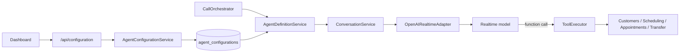

# Configuración y capacidades actuales del agente

> Estado presente verificado el 10 de septiembre de 2026. Las capacidades
> planeadas se encuentran en `PROJECT_STATUS.md`.

## Construcción de una sesión

El dashboard configura modelo, voz, locale, esfuerzo de razonamiento, límite de
salida, VAD, instrucciones y herramientas. La configuración se valida, persiste
por tenant y aplica a la próxima conversación.

## Registro de capacidades por modelo

`RealtimeModelCapabilityRegistry` es la única fuente soportada de modelos,
voces, límites y controles. `GET /api/configuration` publica una copia de ese
registro; el panel construye sus opciones desde la respuesta y vuelve a validar
la combinación antes de enviarla. `AgentConfigurationService` aplica la misma
validación en backend, por lo que un cliente modificado no puede guardar un
modelo, voz, esfuerzo o límite fuera del registro.

| Modelo habilitado | Contexto del modelo | Salida máxima del modelo | Límite explícito por respuesta |
|---|---:|---:|---:|
| `gpt-realtime-2.1` | 128 000 | 32 000 | 1–4096 |
| `gpt-realtime-2.1-mini` | 128 000 | 32 000 | 1–4096 |

La separación entre “salida máxima del modelo” y “límite explícito por
respuesta” es intencional. La ficha del modelo declara la primera capacidad,
mientras que el contrato Realtime acepta un entero de 1 a 4096 (o `inf`) para
`max_output_tokens`. YIBO usa siempre el entero acotado y mantiene 64 como el
mínimo práctico del slider, sin relajar la validación de API.

El registro también declara soporte del proveedor para razonamiento,
`tool_choice`, llamadas paralelas, tracing y truncación. Los controles de
`AGENT-004` usan uniones discriminadas y validación por modelo, nunca JSON libre.
Los campos que sólo corresponden a un modo de detección de turno no pueden
aparecer en otro.

Fuentes normativas consultadas:

- [GPT-Realtime-2.1](https://developers.openai.com/api/docs/models/gpt-realtime-2.1)
- [GPT-Realtime-2.1 Mini](https://developers.openai.com/api/docs/models/gpt-realtime-2.1-mini)
- [Accept call — Realtime API](https://developers.openai.com/api/reference/cli/resources/realtime/subresources/calls/methods/accept)
- [Voice activity detection (VAD)](https://developers.openai.com/api/docs/guides/realtime-vad)

El registro backend de herramientas también es la fuente de los títulos,
descripciones, iconos, clasificación y ruta segura mostrados por el dashboard.
Así una herramienta nueva puede mostrarse con fallback sin romper el panel.

Los valores recomendados se construyen en una única fábrica versionada del
módulo Agents. Bootstrap y el panel consumen esa fábrica; el adaptador Realtime
usa siempre la definición ya resuelta y no sustituye modelo, voz o tokens.

El documento canónico incluye `schemaVersion: 4` y separa `identity`,
`conversation`, `audio`, `behavior`, `toolPolicies` y `enabledTools`. Las
configuraciones históricas sin versión, v1, v2 o v3 se actualizan en memoria y
SQLite, preservando sus valores y completando sólo campos ausentes. SQLite
guarda la forma canónica al primer acceso y una versión futura desconocida se
rechaza.

## Controles Realtime editables

| Sección | Controles | Default conservador |
|---|---|---|
| `identity` | instrucciones y locale | locale del tenant |
| `conversation` | modelo, razonamiento y límite de salida | registro/modelo recomendado |
| `conversation.tracing` | deshabilitado o `auto` | deshabilitado por privacidad |
| `conversation.truncation` | `auto`, deshabilitada o retention ratio | `auto` |
| `audio` | voz y reducción de ruido deshabilitada/near/far field | `near_field` |
| `audio.turnDetection` | `server_vad`, `semantic_vad` o manual | `server_vad` |
| `server_vad` | threshold, padding, silencio e inactividad | VAD histórico, 6 s inactivo |
| `semantic_vad` | eagerness | `auto` |
| ambos VAD | respuesta e interrupción automáticas | activadas |

`behavior` estructura decisiones que antes estaban duplicadas en prompts:
saludo automático o espera del caller; brevedad, tono y ritmo; mensaje y máximo
de repreguntas por silencio; número y estrategia de horarios ofrecidos; y orden
de nombre, teléfono y servicio. `AgentPromptCompiler` transforma esos campos en
instrucciones después de la guía editable, y el adaptador Realtime consume sólo
el prompt compilado. El runtime inicia el saludo únicamente cuando se configuró
como automático y cancela respuestas de silencio que excedan el límite. Los
defaults v2→v3 conservan el comportamiento anterior y localizan el mensaje de
silencio para español.

El mensaje y su límite sólo producen respuestas automáticas cuando se usa
`server_vad` con `createResponse` activado e `idleTimeoutMs` configurado. En los
demás modos no se simula un timeout local ni se cancela una respuesta posterior.

El modo manual se representa y se envía como `turn_detection: null`; sólo debe
activarse en un canal que tenga un gesto explícito para cerrar el turno. La
telefonía continua no proporciona ese gesto: una definición de llamada con modo
manual se rechaza de forma segura, mientras Voice Lab sí puede usarlo.

El texto que edita un administrador es guía, no el prompt completo.
`AgentPromptCompiler` lo delimita y compone después el contexto confiable de la
sucursal y reglas que no son editables: el modelo no elige tenant, sucursal,
cliente ni destino; no inventa estado externo y sólo confirma mutaciones después
de un resultado exitoso de la herramienta.

PCM mono a 24 kHz sigue siendo una invariante del transporte, no una preferencia
administrativa. `tool_choice` ya se configura por canal; la ejecución paralela
permanece pendiente de la clasificación segura de `AGENT-007`. El panel actual edita el
perfil `server_vad`; los modos avanzados ya están disponibles en el contrato y
API, y su UI condicionada por capacidad corresponde a `UI-002/UI-003`.

## Políticas de herramientas

`toolPolicies` limita por separado telefonía y Voice Lab. Cada canal tiene una
lista que debe ser subconjunto de `enabledTools` y un `toolChoice` enumerado
(`auto`, `required` o `none`). La definición del agente resuelve el canal desde
contexto del servidor; el modelo no puede aportarlo ni cambiarlo. Con `none`,
las herramientas tampoco se anuncian en la sesión ni en el prompt compilado.

Un ejecutor efímero por llamada aplica el máximo total y los máximos por
herramienta. Sólo repite resultados que el dominio marcó `retryable`, entre una
y tres tentativas totales y conservando el mismo tool-call/idempotency key. La
transferencia automática puede activarse ante límite o fallo reintentable; usa
`HumanTransferPort` y el destino configurado de la sucursal, nunca argumentos
del modelo. Los defaults de la migración v3→v4 dejan un límite total de 20, una
sola tentativa y transferencia automática desactivada.

El paralelismo también es una opción por canal, desactivada por default. La API
rechaza activarlo si cualquier herramienta seleccionada es `mutate` o
`external`, usando la clasificación del registro backend. Voice Lab incluye
tools de prueba mutables, por lo que no admite paralelismo mientras estén
disponibles. La definición vuelve a evaluar las tools efectivas y el adaptador
sólo entonces envía `parallel_tool_calls: true`.

## Herramientas implementadas

| Tool | Acción | Protección principal |
|---|---|---|
| `check_availability` | Consulta slots reales o una hora exacta | Servicio/empleado y zona se resuelven en backend |
| `update_customer` | Guarda nombre completo y teléfono | Cliente procede de la llamada |
| `create_appointment` | Crea y confirma una cita | Requiere slot consultado, ownership e idempotencia |
| `cancel_appointment` | Cancela cita y evento | Verifica cliente propietario |
| `reschedule_appointment` | Valida nuevo slot y sustituye evento | Verifica cliente y compensa fallo externo |
| `transfer_to_human` | Solicita destino configurado | El modelo no proporciona el destino |
| `enable_developer_test_mode` | Activa fixtures aislados | Sólo sesión local autorizada |
| `delete_test_appointments` | Limpia citas de esa prueba | Sólo citas de la sesión de prueba |

`tenantId`, `callId`, `customerId` e idempotencia son contexto confiable y se
rechazan si aparecen en argumentos del modelo. Deshabilitar una herramienta
impide que sea registrada en la sesión.

## Calendario y citas

Availability cruza horarios, duración/buffer, empleados elegibles, ocupación
local y Google FreeBusy. Create vuelve a validar antes de escribir. Google OAuth
se guarda cifrado por tenant y el modelo nunca recibe tokens, otros eventos ni
el motivo por el que una franja está ocupada.

## Datos y privacidad

- No se persisten audio ni transcripciones.
- El consumo guarda tokens, milisegundos de audio y conteos de tools.
- La API key sólo procede del entorno y el panel muestra únicamente su estado.
- Los logs operativos deben conservar tenant/call para correlación sin datos de
  pacientes; el endurecimiento pendiente está trazado en `OBS-001`.
