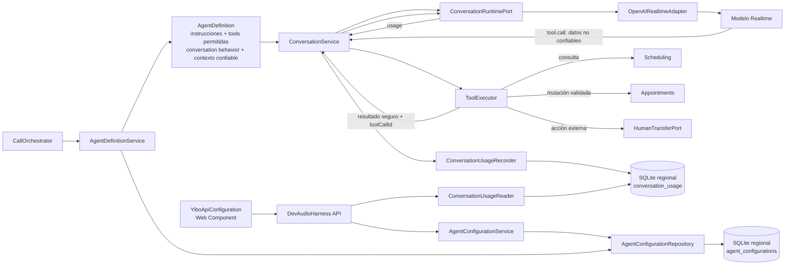
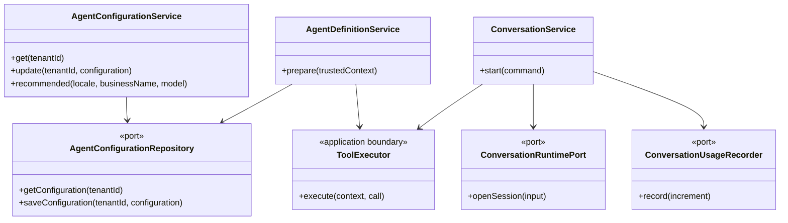

# Mapa de configuración, modelo y capacidades

## Flujo de control

## Permisos efectivos

| Configuración | El modelo puede solicitar | Autoridad final |
|---|---|---|
| `check_availability` | Consultar servicios y horarios disponibles | `SchedulingService` |
| `create_appointment` | Proponer la creación de una cita | `ToolExecutor` valida argumentos; `Appointments` revalida disponibilidad e idempotencia |
| `cancel_appointment` | Proponer cancelar una cita | `ToolExecutor` verifica que pertenece al cliente confiable; `Appointments` ejecuta |
| `transfer_to_human` | Solicitar transferencia | `HumanTransferPort` y su configuración externa |
| Tool deshabilitada | Nada: no se registra en la sesión | `AgentDefinitionService` filtra antes de abrir la conversación |

`tenantId`, `callId` y `customerId` nunca son elegidos por el modelo. Proceden del contexto confiable construido por `calls`.

## UML de contratos

## Privacidad y observabilidad

- Se persisten únicamente tokens, milisegundos de audio, número de tools, `tenantId`, `callId` y timestamp.
- No se persisten API keys, prompts, transcripciones ni audio.
- La API key permanece exclusivamente en `OPENAI_API_KEY`.
- El panel muestra si existe una key, nunca su contenido.
