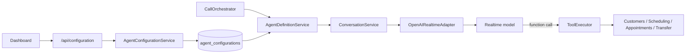

# Configuración y capacidades actuales del agente

> Estado presente verificado el 10 de septiembre de 2026. Las capacidades
> planeadas se encuentran en `PROJECT_STATUS.md`.

## Construcción de una sesión

El dashboard configura modelo, voz, locale, esfuerzo de razonamiento, límite de
salida, VAD, instrucciones y herramientas. La configuración se valida, persiste
por tenant y aplica a la próxima conversación.

## Registro de capacidades por modelo

`RealtimeModelCapabilityRegistry` es la única fuente soportada de modelos,
voces, límites y controles. `GET /api/configuration` publica una copia de ese
registro; el panel construye sus opciones desde la respuesta y vuelve a validar
la combinación antes de enviarla. `AgentConfigurationService` aplica la misma
validación en backend, por lo que un cliente modificado no puede guardar un
modelo, voz, esfuerzo o límite fuera del registro.

| Modelo habilitado | Contexto del modelo | Salida máxima del modelo | Límite explícito por respuesta |
|---|---:|---:|---:|
| `gpt-realtime-2.1` | 128 000 | 32 000 | 1–4096 |
| `gpt-realtime-2.1-mini` | 128 000 | 32 000 | 1–4096 |

La separación entre “salida máxima del modelo” y “límite explícito por
respuesta” es intencional. La ficha del modelo declara la primera capacidad,
mientras que el contrato Realtime acepta un entero de 1 a 4096 (o `inf`) para
`max_output_tokens`. YIBO usa siempre el entero acotado y mantiene 64 como el
mínimo práctico del slider, sin relajar la validación de API.

El registro también declara soporte del proveedor para razonamiento,
`tool_choice`, llamadas paralelas, tracing y truncación. En `AGENT-003` sólo son
editables los campos presentes en el esquema v1; `AGENT-004` incorporará los
controles restantes con discriminantes y validación por modelo, nunca como JSON
libre.

Fuentes normativas consultadas:

- [GPT-Realtime-2.1](https://developers.openai.com/api/docs/models/gpt-realtime-2.1)
- [GPT-Realtime-2.1 Mini](https://developers.openai.com/api/docs/models/gpt-realtime-2.1-mini)
- [Accept call — Realtime API](https://developers.openai.com/api/reference/cli/resources/realtime/subresources/calls/methods/accept)

El registro backend de herramientas también es la fuente de los títulos,
descripciones, iconos, clasificación y ruta segura mostrados por el dashboard.
Así una herramienta nueva puede mostrarse con fallback sin romper el panel.

Los valores recomendados se construyen en una única fábrica versionada del
módulo Agents. Bootstrap y el panel consumen esa fábrica; el adaptador Realtime
usa siempre la definición ya resuelta y no sustituye modelo, voz o tokens.

El documento canónico incluye `schemaVersion: 1`. Las configuraciones históricas
sin versión se actualizan en los repositorios de memoria y SQLite, preservando
sus valores y completando sólo campos ausentes. SQLite guarda la forma canónica
al primer acceso y una versión futura desconocida se rechaza.

El texto que edita un administrador es guía, no el prompt completo.
`AgentPromptCompiler` lo delimita y compone después el contexto confiable de la
sucursal y reglas que no son editables: el modelo no elige tenant, sucursal,
cliente ni destino; no inventa estado externo y sólo confirma mutaciones después
de un resultado exitoso de la herramienta.

El adaptador fija todavía PCM mono a 24 kHz, reducción `near_field`, respuesta e
interrupción automáticas, timeout de silencio, tool choice automático y tools
secuenciales. Estas decisiones permanecen documentadas como brecha hasta que el
esquema versionado permita controlar únicamente combinaciones soportadas.

## Herramientas implementadas

| Tool | Acción | Protección principal |
|---|---|---|
| `check_availability` | Consulta slots reales o una hora exacta | Servicio/empleado y zona se resuelven en backend |
| `update_customer` | Guarda nombre completo y teléfono | Cliente procede de la llamada |
| `create_appointment` | Crea y confirma una cita | Requiere slot consultado, ownership e idempotencia |
| `cancel_appointment` | Cancela cita y evento | Verifica cliente propietario |
| `reschedule_appointment` | Valida nuevo slot y sustituye evento | Verifica cliente y compensa fallo externo |
| `transfer_to_human` | Solicita destino configurado | El modelo no proporciona el destino |
| `enable_developer_test_mode` | Activa fixtures aislados | Sólo sesión local autorizada |
| `delete_test_appointments` | Limpia citas de esa prueba | Sólo citas de la sesión de prueba |

`tenantId`, `callId`, `customerId` e idempotencia son contexto confiable y se
rechazan si aparecen en argumentos del modelo. Deshabilitar una herramienta
impide que sea registrada en la sesión.

## Calendario y citas

Availability cruza horarios, duración/buffer, empleados elegibles, ocupación
local y Google FreeBusy. Create vuelve a validar antes de escribir. Google OAuth
se guarda cifrado por tenant y el modelo nunca recibe tokens, otros eventos ni
el motivo por el que una franja está ocupada.

## Datos y privacidad

- No se persisten audio ni transcripciones.
- El consumo guarda tokens, milisegundos de audio y conteos de tools.
- La API key sólo procede del entorno y el panel muestra únicamente su estado.
- Los logs operativos deben conservar tenant/call para correlación sin datos de
  pacientes; el endurecimiento pendiente está trazado en `OBS-001`.
