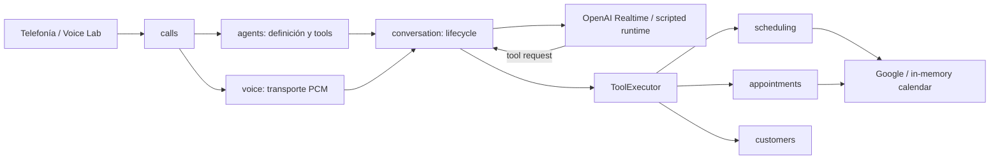

# Arquitectura actual de YIBO

> Verificado el 10 de septiembre de 2026. El avance posterior se consulta en
> [PROJECT_STATUS.md](PROJECT_STATUS.md); los cambios de arquitectura se
> registran en [adr/](adr/README.md).

## Resumen

YIBO es un monolito modular TypeScript con puertos y adaptadores. La aplicación
local ejecutable combina API Fastify, dashboard Vue, SQLite regional, OpenAI
Realtime, Google Calendar y adaptadores de telefonía/voz.

La frontera esencial es:

> El modelo conversa y solicita herramientas; el dominio valida y ejecuta.

## Procesos y composición

- `src/main.ts` inicia la API configurada.
- `src/bootstrap/` abre la base regional, migra, siembra el tenant local y
  conecta servicios, repositorios y adaptadores.
- `src/api/` publica health, negocio, clientes, disponibilidad, citas,
  configuración del agente y OAuth de Google.
- `apps/dev-voice/` ofrece el WebSocket local de prueba de voz.
- `dashboard/src/` contiene el dashboard mantenible.

El runtime se elige por configuración: `in-memory` para desarrollo aislado u
`openai-realtime` para una sesión speech-to-speech. Conversation es el único
dueño de la sesión; Voice sólo transporta PCM mono de 24 kHz.

## Propiedad por módulo

| Módulo | Responsabilidad actual |
|---|---|
| `business` | Perfil del tenant, servicios, empleados, números, horario, locale y zona |
| `customers` | Identidad y contacto tenant-scoped |
| `scheduling` | Cálculo y validación de slots contra reglas y calendarios |
| `appointments` | Crear, consultar, cancelar y reprogramar con idempotencia |
| `agents` | Configuración, definición de tools y frontera de confianza |
| `conversation` | Lifecycle Realtime, audio, tool calls, interrupción y consumo |
| `voice` | Transporte bidireccional de frames de audio |
| `calls` | Lifecycle de llamada y contexto confiable |
| `telephony` | Contrato y gateway Asterisk |
| `integrations` | Google OAuth/Calendar y calendario en memoria |
| `billing` | Lectura opcional de costos de organización OpenAI |

## Configuración del agente

La configuración se guarda por tenant en `agent_configurations` como JSON y se
lee al iniciar cada conversación. Contiene instrucciones, locale, voz,
herramientas habilitadas, modelo, límite de salida, razonamiento y VAD. Los
cambios del dashboard aplican a la conversación siguiente.

`AgentDefinitionService` filtra herramientas antes de abrir la sesión.
`OpenAIRealtimeAdapter` traduce la definición neutral al payload del proveedor.
El adaptador todavía agrega reglas conversacionales y defaults propios; el
roadmap los moverá a una fábrica/compilador versionado.

## Disponibilidad y citas

Scheduling genera slots cada 15 minutos y cruza:

1. zona horaria y horario del negocio;
2. empleado activo y elegible para el servicio;
3. duración y buffer;
4. citas confirmadas locales disponibles para el adaptador;
5. ocupación externa mediante Google FreeBusy.

Appointments revalida el slot bajo un guard, guarda `PENDING_CONFIRMATION`, crea
el evento externo y sólo entonces guarda `CONFIRMED`. La reprogramación crea el
reemplazo antes de cancelar el evento anterior y compensa si falla el segundo
paso. La cancelación y reprogramación verifican propiedad del cliente en la
frontera de tools.

## Persistencia e integraciones

- SQLite se separa por región MX/US y todas las claves operativas incluyen
  `tenant_id`.
- Las migraciones viven en `src/infrastructure/database/migrations/`.
- Google OAuth guarda tokens cifrados por tenant.
- Google Calendar usa hoy un `calendarId` global del entorno y resuelve la zona
  desde el perfil del tenant.
- El modo de prueba usa negocio, agenda y calendario en memoria aislados.

## Invariantes

- El modelo no elige `tenantId`, `callId`, `customerId` ni idempotency key.
- Campos confiables enviados por una tool son rechazados.
- Instantes persistidos y contratos internos usan ISO UTC; la conversación usa
  la zona IANA del negocio.
- Consultar disponibilidad no reserva.
- Una cita no se anuncia como creada hasta quedar `CONFIRMED`.
- SDKs externos permanecen en infraestructura.
- No se persisten audio ni transcripciones.
- Las herramientas de desarrollo no se registran en sesiones normales.

## Seguridad administrativa

Los endpoints administrativos usan sesiones firmadas en cookie HttpOnly. El
rol `tenant_admin` administra agente, negocio y calendarios; `operator` puede
consultar el negocio y operar clientes, disponibilidad y citas. Las mutaciones
exigen el `Origin` configurado y ningún endpoint acepta tenant o región desde
datos no confiables. La auditoría redactada sigue pendiente en el checkpoint
activo.

## Superficie y brechas activas

El dashboard permite probar voz, configurar agente/tools, conectar Google,
consultar disponibilidad, crear/buscar citas y cambiar zona horaria. No permite
todavía administrar servicios, empleados, horarios, destinos ni calendarios por
profesional.

Las brechas, orden y evidencia actual se mantienen exclusivamente en
`PROJECT_STATUS.md` para evitar que este documento vuelva a convertirse en un
roadmap obsoleto.
