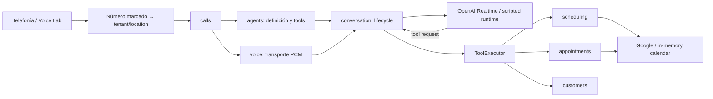

# Arquitectura actual de YIBO

> Verificado el 10 de septiembre de 2026. El avance posterior se consulta en
> [PROJECT_STATUS.md](PROJECT_STATUS.md); los cambios de arquitectura se
> registran en [adr/](adr/README.md).

## Resumen

YIBO es un monolito modular TypeScript con puertos y adaptadores. La aplicación
local ejecutable combina API Fastify, dashboard Vue, SQLite regional, OpenAI
Realtime, Google Calendar y adaptadores de telefonía/voz.

La frontera esencial es:

> El modelo conversa y solicita herramientas; el dominio valida y ejecuta.

## Procesos y composición

- `src/main.ts` inicia la API configurada.
- `src/bootstrap/` abre la base regional, migra, siembra el tenant local y
  conecta servicios, repositorios y adaptadores.
- `src/api/` publica health, negocio, clientes, disponibilidad, citas,
  configuración del agente y OAuth de Google.
- `apps/dev-voice/` ofrece el WebSocket local de prueba de voz.
- `dashboard/src/` contiene el dashboard mantenible.

El runtime se elige por configuración: `in-memory` para desarrollo aislado u
`openai-realtime` para una sesión speech-to-speech. Conversation es el único
dueño de la sesión; Voice sólo transporta PCM mono de 24 kHz.

## Propiedad por módulo

| Módulo | Responsabilidad actual |
|---|---|
| `business` | Perfil del tenant, servicios, empleados, números, horario, locale y zona |
| `customers` | Identidad y contacto tenant-scoped |
| `scheduling` | Cálculo y validación de slots contra reglas y calendarios |
| `appointments` | Crear, consultar, cancelar y reprogramar con idempotencia |
| `agents` | Configuración, definición de tools y frontera de confianza |
| `conversation` | Lifecycle Realtime, audio, tool calls, interrupción y consumo |
| `voice` | Transporte bidireccional de frames de audio |
| `calls` | Lifecycle de llamada y contexto confiable |
| `telephony` | Contrato y gateway Asterisk |
| `integrations` | Google OAuth/Calendar y calendario en memoria |
| `billing` | Lectura opcional de costos de organización OpenAI |

Business ya define el contrato validado de siguiente generación: catálogos de
servicios y profesionales compartidos y sucursales con `LocationId`, dirección,
zona, locale, números, horarios, cierres, políticas, precios y asignaciones de
calendario. El formato histórico se reconoce como v1 y un upgrader puro,
idempotente y validado produce la única forma v2, incluyendo la sucursal
`default` y defaults conservadores. `BusinessDirectory` entrega siempre esa
forma canónica aunque la persistencia todavía contenga v1. El número marcado
resuelve exactamente un `{tenantId, locationId}` activo; Calls conserva ambos y
los propaga como contexto confiable a AgentDefinition, tools, Scheduling y
Appointments. Los fixtures MX/US y el repositorio en memoria también almacenan
v2; aceptar v1 queda limitado a fronteras de migración compatibles.

## Configuración del agente

La configuración se guarda por tenant en `agent_configurations` como JSON y se
lee al iniciar cada conversación. Contiene instrucciones, locale, voz,
herramientas habilitadas, modelo, límite de salida, razonamiento y VAD. Los
cambios del dashboard aplican a la conversación siguiente.

`AgentDefinitionService` filtra herramientas antes de abrir la sesión.
`OpenAIRealtimeAdapter` traduce la definición neutral al payload del proveedor.
Por llamada, `ConfirmationGateToolExecutor` precede al ejecutor de límites: liga
las mutaciones configuradas a un token, argumentos y secuencia de turno antes de
permitir que una solicitud alcance el dominio.
El adaptador todavía agrega reglas conversacionales y defaults propios; el
roadmap los moverá a una fábrica/compilador versionado.

## Disponibilidad y citas

Scheduling genera slots cada 15 minutos y cruza:

1. zona horaria y horario de la sucursal resuelta;
2. profesional activo y asignado al servicio en esa sucursal;
3. duración y buffer;
4. citas confirmadas locales disponibles para el adaptador;
5. ocupación externa mediante Google FreeBusy.

El horario particular del profesional se intersecta por día e intervalo con el
de la sucursal. Una lista particular vacía significa herencia explícita del
horario de sucursal; la indisponibilidad se representa desactivando la
asignación, no mediante un significado ambiguo de lista vacía.
Los cierres se configuran como rangos de reloj local y Scheduling los convierte
con la zona IANA de la sucursal tanto al listar como al revalidar. El motivo
administrativo no forma parte de `AvailableSlot` ni de los errores para caller.
La política completa de cada sucursal tiene una API administrativa versionada
en `/api/admin/locations/:locationId/scheduling-policy`; sólo admite el esquema
soportado y un servicio predeterminado activo de esa sucursal.
Scheduling aplica `slotIncrementMinutes`, anticipación, horizonte y máximo de
resultados al listar y al revalidar. Appointments aplica por dominio los avisos
mínimos de cancelación y reprogramación; el prompt no puede evadirlos.
La capacidad del profesional permanece en 1 y se aplica además el límite
concurrente de la sucursal. Las reservas se serializan por `{tenant, location}`
para que profesionales distintos no excedan el último cupo durante una carrera.

Appointments revalida el slot bajo un guard, guarda `PENDING_CONFIRMATION`, crea
el evento externo y sólo entonces guarda `CONFIRMED`. La reprogramación crea el
reemplazo antes de cancelar el evento anterior y compensa si falla el segundo
paso. La cancelación y reprogramación verifican propiedad del cliente en la
frontera de tools. Al crear, la cita congela el nombre y `Money` de la oferta;
reprogramar o cambiar el catálogo no modifica ese snapshot histórico.

La lectura de próximas citas filtra en el repositorio por tenant, location,
customer, estado confirmado e instante actual. El ejecutor del agente proyecta
después una vista pública con referencias efímeras ligadas a la llamada; los IDs
persistidos no cruzan la frontera del modelo. Cancelación y reprogramación sólo
aceptan esas referencias en la misma llamada, las resuelven en memoria y repiten
la comprobación de ownership antes de invocar el dominio.

## Persistencia e integraciones

- SQLite se separa por región MX/US y todas las claves operativas incluyen
  `tenant_id`.
- El bootstrap configurado usa repositorios SQLite para negocio, clientes,
  citas y llamadas; las referencias profesionales consideran también citas
  persistidas antes de permitir una eliminación.
- Las migraciones viven en `src/infrastructure/database/migrations/`; la v7
  agrega `location_id` a números, llamadas y citas y la v8 agrega la versión
  optimista del documento de negocio. La v9 rellena nombre/precio histórico en
  citas existentes. Todas conservan los registros previos.
- Google OAuth guarda tokens cifrados por tenant. Toda asignación nueva o
  modificada se consulta contra Google antes de activarse; la API administrativa
  publica estados seguros (`accessible`, desconectado, prohibido, no encontrado
  o no disponible), nunca credenciales.
- Google Calendar resuelve `{calendarId, timezone}` desde
  `{tenantId, locationId, employeeId}` confiable. La asignación del profesional
  gana y el default de sucursal actúa como fallback. `GOOGLE_CALENDAR_ID` sólo
  existe como importación transitoria al documento, no dirige operaciones.
  FreeBusy, alta y cancelación usan esa misma resolución; los logs conservan
  IDs correlacionables y metadata operativa, pero no calendar IDs, tokens ni PII.
- El modo de prueba usa negocio, agenda y calendario en memoria aislados.
- Cada sucursal puede guardar un destino de transferencia tipado como teléfono
  normalizado o extensión numérica. La API versionada no admite URI, SIP ni un
  destino proporcionado por el modelo.
- `TelephonyHumanTransferAdapter` resuelve ese destino con el contexto confiable,
  persiste `TRANSFERRING` y luego `TRANSFERRED`; un fallo del gateway compensa el
  estado a `IN_CONVERSATION` para que el agente pueda seguir atendiendo.
- La configuración del agente es un documento versionado. Los repositorios
  convierten la forma histórica sin versión a la forma canónica v1 y SQLite la
  reescribe al primer acceso; versiones futuras desconocidas fallan cerradas.
- `AgentPromptCompiler` convierte la guía editable en una sección delimitada y
  añade identidad, locale, zona de la sucursal, tools habilitadas y reglas
  inmutables. `AgentDefinitionService` falla si no puede obtener ese contexto
  usando el tenant/location confiable de la llamada.
- `buildRealtimeSessionUpdate` es la única frontera que traduce una definición
  validada al contrato `session.update`; valida de nuevo capacidades antes de
  que el adaptador abra una conexión con el proveedor.

## Invariantes

- Las sesiones de producto (`phone` y `voice_lab`) usan modalidad de audio y
  PCM16 little-endian mono a 24 kHz. Codec, tasa, canales y formato proveedor
  proceden de una sola constante de transporte y no son configuración admin.
- El modelo no elige `tenantId`, `locationId`, `callId`, `customerId` ni
  idempotency key.
- Campos confiables enviados por una tool son rechazados.
- Instantes persistidos y contratos internos usan ISO UTC; la conversación usa
  la zona IANA del negocio.
- Consultar disponibilidad no reserva.
- Una cita no se anuncia como creada hasta quedar `CONFIRMED`.
- SDKs externos permanecen en infraestructura.
- No se persisten audio ni transcripciones.
- Las herramientas de desarrollo no se registran en sesiones normales.

## Seguridad administrativa

Los endpoints administrativos usan sesiones firmadas en cookie HttpOnly. El
rol `tenant_admin` administra agente, negocio y calendarios; `operator` puede
consultar el negocio y operar clientes, disponibilidad y citas. Las mutaciones
exigen el `Origin` configurado y ningún endpoint acepta tenant o región desde
datos no confiables. Cada mutación administrativa actual registra sujeto,
tenant, entidad, acción, versión, instante y diff; credenciales, PII e
instrucciones se sustituyen por marcadores o huellas antes de persistir.
La configuración multi-sucursal completa se lee y reemplaza mediante
`/api/admin/business-configuration`; `PUT` exige `If-Match`, incrementa la
versión atómicamente y responde `409 CONFIGURATION_VERSION_CONFLICT` si otro
editor ganó la carrera.
El catálogo tenant-wide de servicios cuenta además con endpoints CRUD en
`/api/admin/services`; cada mutación usa la misma versión del documento,
auditoría y protección contra borrar o desactivar referencias asignadas.
`/api/admin/professionals` administra el catálogo de profesionales y
`/api/admin/locations/:locationId/professionals/:professionalId` administra su
asignación, servicios, horario y calendario por sucursal. Las referencias en
asignaciones o citas deben migrarse antes de desactivar o eliminar.
Cada oferta sucursal–servicio expresa su precio como
`Money { amountMinor, currency }`; Business exige unidades menores enteras no
negativas y una moneda ISO 4217. El precio sigue siendo informativo, sin pagos.

## Superficie y brechas activas

El dashboard permite probar voz, configurar agente/tools, conectar Google,
consultar disponibilidad, crear/buscar citas y cambiar zona horaria. No permite
todavía administrar servicios, empleados, horarios, destinos ni calendarios por
profesional.

Las brechas, orden y evidencia actual se mantienen exclusivamente en
`PROJECT_STATUS.md` para evitar que este documento vuelva a convertirse en un
roadmap obsoleto.
