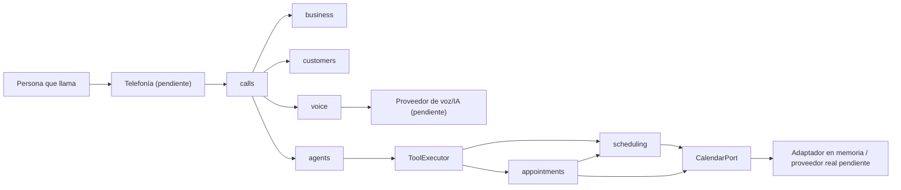
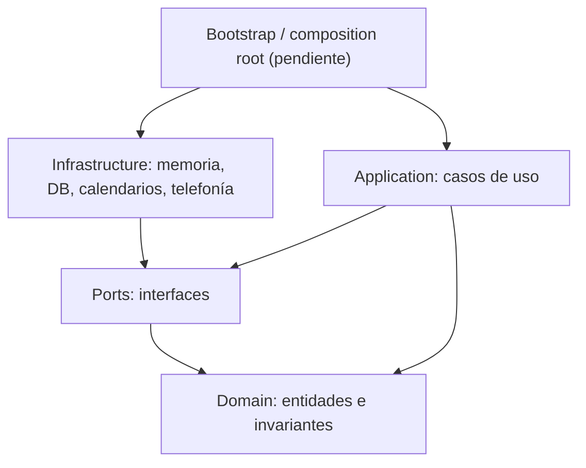
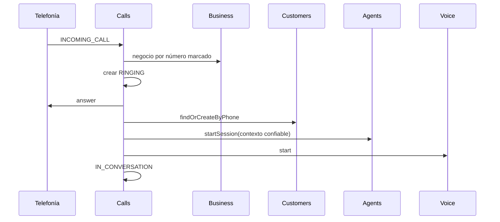
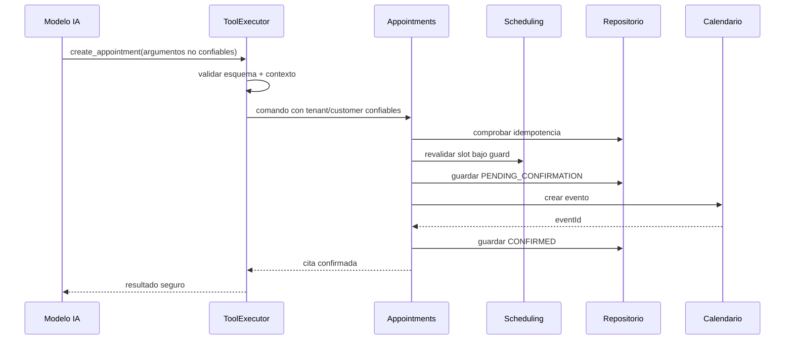

# Arquitectura actual de YIBO

> Estado analizado: 23 de agosto de 2026. Este documento describe el código que existe hoy. El archivo `YIBO_ARCHITECTURE_AND_CODEX_CONTRACTS.md` sigue siendo la arquitectura objetivo y el contrato de diseño.

## 1. Resumen ejecutivo

YIBO está planteado como un **monolito modular** en TypeScript, organizado con **arquitectura hexagonal (puertos y adaptadores)**. El producto objetivo es una recepcionista telefónica multi-tenant capaz de conversar mediante IA, consultar disponibilidad, administrar citas y transferir llamadas.

La regla esencial es:

> La IA conversa; el dominio de YIBO valida, decide y ejecuta; telefonía sólo transporta la llamada.

El repositorio contiene un núcleo de dominio y aplicación bien probado, pero todavía no contiene una aplicación desplegable. No hay composition root, servidor/API, adaptador de telefonía, proveedor de IA real ni persistencia conectada. Las implementaciones disponibles son principalmente en memoria.

## 2. Vista del sistema



El flujo existe como contratos y servicios desacoplados. Todavía falta conectarlos en un proceso ejecutable.

## 3. Estructura real del repositorio

```text
YIBO/
├── src/
│   ├── modules/
│   │   ├── business/       configuración del negocio
│   │   ├── customers/      identidad y contacto del cliente
│   │   ├── scheduling/     cálculo y validación de disponibilidad
│   │   ├── appointments/   ciclo de vida de citas
│   │   ├── agents/         sesión de IA y herramientas seguras
│   │   ├── voice/          puente de audio bidireccional
│   │   ├── calls/          orquestación de la llamada
│   │   └── integrations/   adaptador de calendario en memoria
│   └── shared/             Result e identificadores compartidos
├── tests/                  pruebas unitarias por módulo
├── dashboard/dist/         build compilado; no hay fuente del dashboard
├── data/                   SQLite no rastreado por Git ni conectado al código
├── docs/                   documentación operativa
└── YIBO_ARCHITECTURE_AND_CODEX_CONTRACTS.md
```

La forma interna esperada de cada módulo es:

```text
domain/          reglas y entidades puras
application/     casos de uso y orquestación
ports/           interfaces requeridas por el módulo
infrastructure/  implementaciones de los puertos
index.ts         API pública del módulo
```

No todos los módulos necesitan todas las carpetas. La regla importante es que las dependencias externas entren por puertos y que otros módulos consuman el `index.ts` público.

## 4. Capas y dirección de dependencias



Las clases de aplicación reciben sus dependencias por constructor. Esto permite sustituir memoria por PostgreSQL, Google Calendar, Asterisk u otro proveedor sin cambiar las reglas centrales.

Dependencias reales principales:

| Módulo | Consume | Motivo |
|---|---|---|
| `business` | `shared` | resultados tipados e IDs |
| `customers` | `shared` | IDs y resultado |
| `scheduling` | API pública de `business`, puertos propios, `shared` | reglas, horarios y conflictos |
| `appointments` | APIs públicas de `business` y `scheduling`, puertos propios | revalidar y confirmar citas |
| `agents` | APIs públicas de `scheduling` y `appointments` | ejecutar tools controladas |
| `voice` | puerto propio de proveedor IA | transportar audio |
| `calls` | API pública de `business` y puertos propios | coordinar el flujo completo |
| `integrations` | actualmente puertos internos de calendario | implementar calendario compartido |

### Observación de frontera

`integrations/calendar/in-memory-calendar-adapter.ts` importa directamente los archivos de puertos internos de `appointments` y `scheduling`, no sus `index.ts`. Funciona, pero contradice parcialmente la regla de consumir contratos públicos. Conviene exportar esos puertos desde las APIs públicas o mover un contrato común de calendario a una ubicación estable antes de crear el adaptador real.

## 5. Responsabilidad de cada módulo

### `business`

Es dueño del perfil del tenant: nombre, zona horaria, locale, números telefónicos, empleados, servicios y horario de apertura. Resuelve el negocio por `tenantId` o por número marcado y valida la configuración.

No administra clientes ni transacciones de citas.

### `customers`

Busca o crea clientes por teléfono dentro de un tenant, normaliza teléfono/nombre/email y evita duplicar números en el mismo tenant. Las consultas incluyen `tenantId`, por lo que el aislamiento está incorporado al contrato.

### `scheduling`

Calcula slots cada 15 minutos y valida un slot específico. Cruza:

1. horario del negocio;
2. horario del empleado;
3. duración y buffer del servicio;
4. citas confirmadas locales;
5. ocupación del calendario externo;
6. zona horaria IANA del negocio.

Consultar disponibilidad no reserva nada. La validación definitiva ocurre nuevamente al crear una cita.

### `appointments`

Es dueño de las mutaciones de cita: crear, cancelar, reprogramar y consultar. La creación:

1. valida datos e idempotencia;
2. verifica cliente, servicio y empleado;
3. entra al guard de concurrencia;
4. revalida el slot;
5. guarda `PENDING_CONFIRMATION`;
6. crea el evento externo;
7. guarda `CONFIRMED` o `FAILED`.

La cancelación sincroniza primero el calendario y después el estado local. La reprogramación crea el reemplazo, cancela el evento anterior y compensa cancelando el reemplazo si falla el segundo paso.

### `agents`

Abre la sesión del agente con instrucciones/configuración por tenant y registra cuatro herramientas: consultar disponibilidad, crear cita, cancelar cita y transferir a humano.

`ToolExecutor` es la frontera de confianza. Rechaza argumentos desconocidos y campos confiables (`tenantId`, `callId`, `customerId`, `idempotencyKey`) enviados por el modelo. Esos valores sólo llegan desde el contexto de llamada. También comprueba propiedad del cliente antes de cancelar.

### `voice`

Conecta audio entrante con un proveedor de voz y devuelve el audio generado hacia telefonía. Verifica que la identidad de llamada coincida y hace cierre idempotente.

### `calls`

Orquesta eventos de telefonía. Para una llamada entrante: resuelve negocio, crea registro, contesta, encuentra/crea cliente, abre agente, abre voz y marca conversación activa. En hangup cierra voz, luego agente, y termina el registro.

Los estados `TRANSFERRING` y `TRANSFERRED` están definidos, pero el flujo de transferencia todavía no está conectado al orquestador.

### `integrations`

Sólo contiene un calendario en memoria que satisface tanto consultas de ocupación como creación/cancelación de eventos. Es útil para pruebas, no para producción.

## 6. Flujos críticos

### Entrada de llamada



### Creación de cita por IA



## 7. Decisiones e invariantes que no deben romperse

- `tenantId` proviene de un contexto confiable, nunca del modelo.
- Todas las fechas persistidas y contratos internos usan ISO 8601 UTC; las reglas humanas usan la zona IANA del negocio.
- Scheduling consulta; Appointments muta.
- Toda creación revalida disponibilidad dentro de un guard de concurrencia.
- La idempotencia evita duplicados en reintentos.
- Nunca se anuncia una cita como creada si no está `CONFIRMED`.
- Los errores del dominio son tipados; al modelo se le entrega un mensaje seguro, no excepciones internas.
- SDKs de proveedores deben permanecer dentro de adaptadores.
- Los módulos no deben importar infraestructura de otros módulos.

## 8. Estado de calidad comprobado

- TypeScript `strict` y `noUncheckedIndexedAccess` activados.
- Typecheck exitoso con el compilador local.
- 9 archivos de prueba, 44 pruebas aprobadas.
- Cobertura conductual de multi-tenancy, idempotencia, concurrencia, calendario, tools, voz y ciclo básico de llamada.

Esto no equivale a cobertura total ni a una prueba end-to-end del producto real. Las pruebas actuales usan dobles o adaptadores en memoria.

## 9. Brechas y riesgos actuales

### Bloqueantes para ejecutar el producto

1. No existe `bootstrap` o composition root que instancie y conecte los módulos.
2. No existe aplicación API ni proceso de entrada.
3. No existe módulo/adaptador de telefonía (Asterisk/ARI).
4. No existe proveedor real de IA/voz.
5. No existe repositorio persistente conectado; SQLite en `data/` no es usado por `src/`.
6. No existe adaptador de calendario externo real.
7. No existe configuración/secretos por entorno y tenant.

### Importantes antes de producción

- Observabilidad estructurada y correlación por `callId`/`tenantId` no implementadas.
- No hay migraciones ni esquema de base de datos versionado.
- El guard de concurrencia en memoria sólo protege un proceso y bloquea por empleado completo, no por intervalo.
- Los registros de llamada se guardan sólo en memoria y no incluyen historial de transiciones.
- Los timestamps de transiciones usan el `occurredAt` del evento inicial durante el arranque, no un reloj de aplicación.
- Un fallo durante el arranque de llamada no aplica una rutina única de compensación para todos los recursos abiertos.
- La transferencia humana no actualiza el estado de `calls`.
- `reschedule_appointment` existe en dominio, pero no está expuesto como tool del agente.
- No hay autenticación/autorización de dashboard ni política implementada de privacidad de audio/transcripciones.
- `dashboard/dist` es un artefacto compilado sin código fuente mantenible en este repositorio.
- README y estructura objetivo están desactualizados respecto al código real.

## 10. Diseño objetivo inmediato

El siguiente hito debe conservar el monolito modular y añadir una capa exterior pequeña:

```text
apps/api o src/bootstrap
  ├── configuración
  ├── construcción de repositorios/adaptadores
  ├── wiring de servicios
  ├── lifecycle/shutdown
  └── endpoints/webhooks de entrada
```

La infraestructura concreta implementa los puertos actuales. Si un puerto no alcanza, primero se registra el cambio de contrato/ADR y luego se adapta a consumidores e implementaciones.

