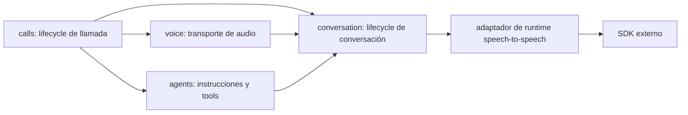

# ADR-001: Reemplazar la separación AI/Voice por un runtime de conversación

- Estado: Aceptado
- Fecha: 25 de agosto de 2026
- Alcance: `agents`, `voice`, nuevo módulo `conversation` y su composición con `calls`

## Contexto

El diseño actual representa la conversación mediante dos abstracciones
independientes:

- `AgentAIProvider`, consumido por `agents`, abre una sesión que recibe tools y
  emite tool calls.
- `VoiceAIProvider`, consumido por `voice`, abre otra sesión que recibe y emite
  audio.

Esta separación presupone que el agente de IA y el procesamiento de voz tienen
lifecycle distintos. No representa correctamente un runtime speech-to-speech
que, dentro de una sola sesión, escucha audio, produce audio, mantiene el estado
de la conversación y solicita la ejecución de tools.

El efecto es una propiedad ambigua del lifecycle: `agents` crea una sesión de
agente, `voice` crea una sesión de voz y `calls` debe pasar la primera a la
segunda. No hay un único dueño de abrir, mantener, completar y cerrar la
conversación. También aparecen detalles de infraestructura en nombres de
contratos de aplicación, por ejemplo `AI_PROVIDER_UNAVAILABLE`.

Los contratos actuales no exponen tipos de un SDK concreto, pero su forma y sus
nombres están centrados en “providers”. Un cambio de proveedor speech-to-speech
no debe alterar contratos de dominio o aplicación.

## Decisión

Introducir un módulo `conversation` como dueño del lifecycle completo de una
conversación. La separación será por responsabilidad de negocio, no por las
capacidades internas de un proveedor.

### `agents`: política y tools

`agents` es dueño de:

- construir las instrucciones de la recepcionista para el tenant y contexto de
  llamada;
- definir la lista y los esquemas de tools aprobadas;
- validar y ejecutar tool calls exclusivamente mediante `ToolExecutor`;
- devolver resultados seguros de tools al coordinador de conversación.

`agents` no abre ni cierra sesiones de IA, no transporta audio y no conoce
clientes SDK. Su salida para `conversation` es una definición neutral del
agente y una capacidad para ejecutar tools.

Una forma orientativa del límite de aplicación es:

```ts
interface ConversationAgent {
  instructions: string;
  locale: string;
  voice?: string;
  tools: AgentToolDefinition[];
  executeTool(call: AgentToolCall): Promise<AgentToolResult>;
}

interface ConversationAgentFactory {
  create(context: ToolExecutionContext): Promise<Result<ConversationAgent, AgentConfigurationError>>;
}
```

Los nombres concretos pueden ajustarse al implementar la migración, pero la
responsabilidad y la dirección de dependencia son obligatorias.

### `voice`: transporte de media

`voice` es dueño de:

- recibir audio de una llamada y exponerlo como flujo de entrada de la
  aplicación;
- escribir audio de salida hacia la llamada;
- adaptar codec, framing, buffering y backpressure cuando sea necesario;
- cerrar el transporte de media de forma idempotente.

`voice` no conoce OpenAI ni ningún otro proveedor de IA, no mantiene la política
del agente, no ejecuta tools y no es dueño de la sesión de conversación. Sus
contratos describen media, no proveedores:

```ts
interface ConversationMedia {
  inbound: AsyncIterable<AudioFrame>;
  outbound: AudioSink;
  close(): Promise<void>;
}
```

### `conversation`: lifecycle y coordinación

`conversation` es dueño de:

- abrir exactamente una sesión de conversación por llamada;
- conectar la media de `voice`, la definición de `agents` y el runtime de IA;
- enviar audio entrante y recibir audio saliente dentro de esa sesión;
- recibir solicitudes de tools, delegarlas al agente y devolver sus resultados;
- propagar finalización, cancelación y errores con semántica de aplicación;
- cerrar la sesión y liberar recursos de manera idempotente.

El puerto requerido por `conversation` será neutral respecto de proveedor y
SDK. Una forma orientativa es:

```ts
interface ConversationRuntime {
  open(input: OpenConversation): Promise<Result<ConversationSession, ConversationRuntimeError>>;
}

interface OpenConversation {
  conversationId: string;
  agent: ConversationAgent;
  media: ConversationMedia;
}

interface ConversationSession {
  completed: Promise<ConversationCompletion>;
  close(): Promise<void>;
}

type ConversationRuntimeError =
  | { code: "AUTHORIZATION_REQUIRED" }
  | { code: "CAPACITY_EXCEEDED"; retryAfterMs?: number }
  | { code: "RUNTIME_UNAVAILABLE"; retryable: boolean }
  | { code: "INVALID_CONFIGURATION"; message: string };
```

El puerto describe capacidades de YIBO. Una implementación concreta puede usar
un SDK de tiempo real speech-to-speech, pero ese SDK y sus tipos permanecen en
un adaptador de infraestructura del módulo `conversation`.

### Integración con `calls`

`calls` continúa siendo dueño del lifecycle de la llamada telefónica y de sus
estados. Durante una llamada entrante:

1. resuelve negocio y cliente;
2. contesta la llamada;
3. obtiene de `voice` el transporte de media;
4. solicita a `agents` la definición contextual del agente;
5. solicita a `conversation` abrir la conversación con ambos;
6. conserva únicamente una referencia cerrable a la conversación.

En hangup, `calls` pide cerrar la conversación y el transporte según la política
de compensación. `calls` no conecta directamente callbacks del SDK ni ejecuta
tools.



## Regla de dependencias

- Dominio y aplicación usan lenguaje propio de YIBO: conversación, agente,
  tool, media, sesión y runtime.
- Ningún contrato de dominio o aplicación menciona OpenAI, nombres de productos,
  SDK, `Provider` ni tipos definidos por proveedores externos.
- La palabra y los tipos del proveedor concreto sólo pueden existir dentro del
  adaptador de infraestructura y su wiring en el composition root.
- `agents` y `voice` no dependen del adaptador del runtime.
- `conversation` depende de sus propios puertos; el adaptador los implementa.

Esta regla aplica al estado final de la migración. Los contratos anteriores se
mantienen temporalmente sólo para permitir una transición segura.

## Plan de migración

No se eliminan `AgentAIProvider`, `VoiceAIProvider`, `AgentRuntime` ni
`VoiceBridge` al aceptar este ADR.

1. Crear el módulo `conversation` con contratos de aplicación y puertos
   neutrales, más pruebas de lifecycle, tools, audio y cierre idempotente.
2. Extraer de `AgentRuntime` una fábrica/constructor de `ConversationAgent` que
   conserve `ToolExecutor` como única vía de ejecución de tools.
3. Convertir `VoiceBridge` en un adaptador de transporte que entregue
   `ConversationMedia`, sin abrir una sesión de IA.
4. Implementar un adaptador de infraestructura para `ConversationRuntime`; ahí
   se encapsulan SDK, autenticación, eventos y errores específicos.
5. Cambiar el composition root y `calls` para abrir una sola conversación.
6. Mantener adaptadores de compatibilidad para consumidores existentes mientras
   se migran pruebas y composición.
7. Cuando no queden consumidores, marcar obsoletos y después eliminar
   `AgentAIProvider`, `VoiceAIProvider`, `ProviderAgentSession`,
   `ProviderVoiceSession` y los errores `AI_PROVIDER_*` de contratos públicos.
8. Verificar que una búsqueda en contratos de `domain/`, `application/` y sus
   índices públicos no encuentre nombres de SDK, productos ni `Provider`.

Cada paso debe conservar la suite existente o reemplazar sus expectativas con
pruebas equivalentes antes de retirar el contrato anterior.

### Estado de implementación — 25 de agosto de 2026

- `conversation` ya contiene el puerto neutral, `ConversationService` y un
  runtime scripted.
- `agents` prepara `AgentDefinition` con tools, `ToolExecutor` y contexto
  confiable; ya no abre sesiones externas.
- `voice` expone únicamente `VoiceMediaGateway` y transporte de media.
- `calls` abre y cierra una sola conversación después de resolver tenant y
  cliente.
- Los contratos `AgentAIProvider`, `VoiceAIProvider`, `AgentRuntime`,
  `VoiceBridge` y sus sesiones fueron eliminados al quedar sin consumidores. No
  permanece una capa de compatibilidad temporal.
- `OpenAIRealtimeAdapter` implementa el puerto mediante WebSocket y está
  cableado por configuración en el composition root. El primer incremento usa
  sólo texto; el transporte de audio real sigue pendiente.

## Consecuencias

### Positivas

- Una llamada tiene una sola sesión de conversación y un dueño claro de su
  lifecycle.
- Speech, audio y tool calls pueden compartir el contexto nativo del runtime.
- `agents` conserva la frontera de confianza de `ToolExecutor`.
- `voice` queda reutilizable para telefonía y transporte sin acoplarse a IA.
- Cambiar de runtime no altera contratos del dominio o aplicación.
- Se simplifica la compensación y el cierre ante hangup o error parcial.

### Costos y riesgos

- Durante la migración coexistirán contratos antiguos y nuevos.
- `calls`, composition roots y pruebas de integración deberán cambiar de forma
  coordinada.
- El adaptador debe manejar concurrencia entre audio, tool calls, finalización y
  cierre sin ejecutar una tool dos veces.
- Será necesario definir límites explícitos de buffering, backpressure y
  cancelación sin filtrarlos hacia `agents`.

## Alternativas rechazadas

### Mantener `AgentAIProvider` y `VoiceAIProvider`

Rechazada porque conserva dos sesiones y dos lifecycles para una capacidad que
el runtime speech-to-speech ofrece de forma unificada.

### Mover todo a `voice`

Rechazada porque convertiría un módulo de transporte en dueño de política,
tools y sesión de IA, y lo acoplaría al proveedor.

### Mover todo a `agents`

Rechazada porque mezclaría transporte y lifecycle de media con la construcción
y ejecución segura del agente.

### Permitir que `calls` coordine directamente el SDK

Rechazada porque filtraría infraestructura al orquestador de llamadas y
duplicaría reglas de lifecycle, errores y cierre.

## Criterios de verificación de la migración

La implementación de esta decisión estará completa cuando:

- `agents` sólo construya instrucciones/tools y ejecute tools mediante
  `ToolExecutor`;
- `voice` sólo transporte media y no conozca OpenAI ni otro runtime de IA;
- `conversation` sea el único dueño de la sesión de conversación;
- cada llamada activa tenga como máximo una sesión de conversación;
- ningún contrato de dominio/aplicación ni API pública mencione un SDK, producto
  externo o `Provider`;
- los contratos anteriores hayan sido retirados después de migrar todos sus
  consumidores, no antes;
- existan pruebas de audio bidireccional, ejecución de tools, errores,
  finalización y cierre idempotente.
